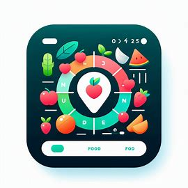
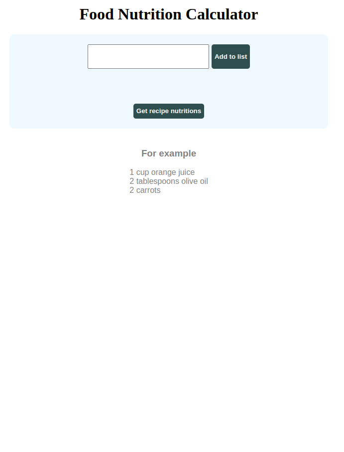
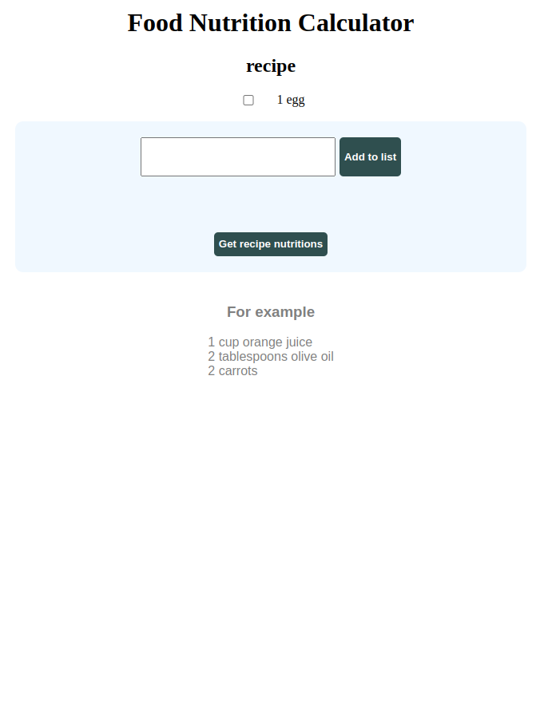
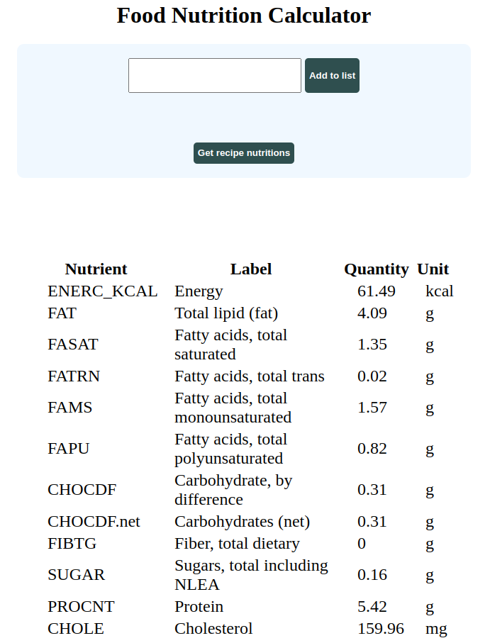
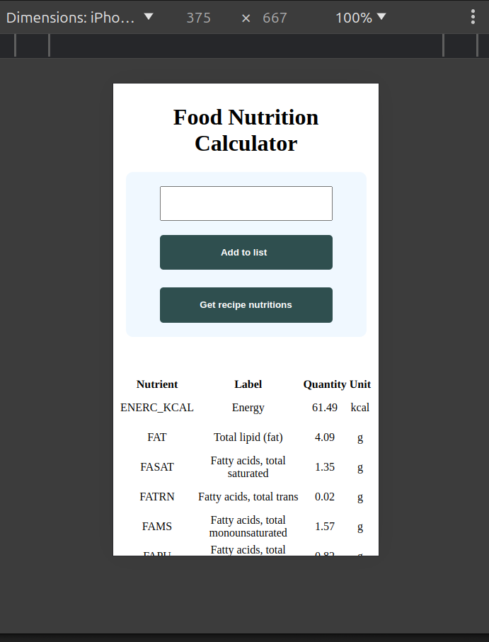

<h1 align="center">
  <br>
 </img>

  <br>
  NutriLog 
  <br>
</h1>

<h4 align="center">A minimal Nutrition app using an API to analyze your recipes ingredients.</h4>

<p align="center">
  <a href="#key-features">Key Features</a> •
  <a href="#how-to-use">How To Use</a> •
  <a href="#download">Download</a> •
  <a href="#credits">Credits</a> •
  <a href="#related">Related</a> •
  <a href="#license">License</a>
</p>

<p align="center">


</p>

<p align="center">


</p>

## Key Features

* **Keep track of your day's nutrients:** Allows users to keep track of their micronutrients and macronutrients.

* **Add multiple quantities:** Don't measure your recipe with the same measures? Easily add the quantities as cups, grams, or even spoons.

* **Dynamic List:** Even if you make a mistake with an ingredient, don't worry; just click the checkbox, and it's deleted.


## How To Use
To clone and run this application, you'll need [Git](https://git-scm.com) and [Node.js](https://nodejs.org/en/download/) (which comes with [npm](http://npmjs.com)) installed on your computer.

For the frontend:

```bash
cd my-app

npm install

npm start
```

For the backend:

```bash
cd back-end

npm install

node server.js
```

For the server, you need to add your APIS keys (from https://www.edamam.com/ ) in the `.env` file :

```env
FOOD_API_KEY=""
<<<<<<< HEAD
=======
```
```env
FOOD_API_ID =""
>>>>>>> e10fb42 (text change)
```
```env
FOOD_API_ID =""
```


## Credits

This software uses the following open-source packages:

- [React.js](https://react.dev/) for the client-side app
- [Node.js](https://nodejs.org/) for the backend
- [Express.js](https://expressjs.com/) API framework

## License

MIT
